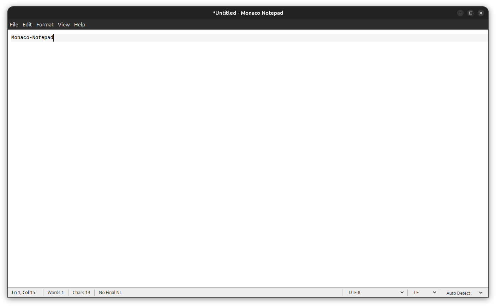

# Monaco Notepad



A minimal, single-document Linux desktop text editor built with Electron, Monaco Editor, and TypeScript. It is syntax-aware, but intentionally not an IDE.

## Version

**Monaco Notepad v2**

v2 is the current release of Monaco Notepad.

## What's new in v2

- Safe Open protection for files that appear binary or otherwise unsafe for normal text editing
- Reopen With Encoding for explicitly reinterpreting an already-open file
- Exact mixed-line-ending detection with explicit LF/CRLF normalization
- Filter Lines with matching/non-matching views and Follow File integration
- Dual-layer Document Inspector for saved-source and current-editor facts
- Regex Extract plus additional text transformation tools
- Typewriter Scrolling for keeping the active cursor vertically centered
- Optional `.bak` backup creation before overwriting an existing file
- Responsive large-file opening with progress reporting and cancellation during file reading
- Dependency, runtime-test, and Flatpak packaging hardening

## Features

- Single-document editing
- Light, dark, and system themes
- Monaco Editor syntax highlighting
- Open, Save, and Save As
- Reload, revert, and Save a Copy without changing document identity
- UTF-8, UTF-8 BOM, UTF-16 LE, UTF-16 BE, and ANSI (Windows-1252) support
- LF and CRLF preservation
- Unsaved-change protection for New, Open, Close, and Exit
- Find, Find Next (F3), Replace, and Go To Line
- Undo, Redo, clipboard editing, Select All, and Time/Date
- Word Wrap
- Toggleable whitespace/control-character display
- Toggleable line numbers (`Ctrl+Shift+F9`)
- Zoom controls
- Status bar with line, column, text statistics, read-only state, encoding, EOL, and language
- Per-document line bookmarks (`Ctrl+Shift+F2`, `F2`, and `Shift+F2`)
- Duplicate and move-line commands backed by Monaco editor actions
- Indent/outdent, line sorting, duplicate/empty-line removal, and current-line selection
- Trailing-whitespace cleanup, tabs/spaces conversion, and optional trim on save
- Toggle line comments and jump to matching brackets using Monaco language support
- Selection conversion to uppercase, lowercase, or deterministic title case
- JSON formatting/minification and conservative XML formatting
- UTF-8-safe Base64, URL-component, and hexadecimal selection transforms
- Selection SHA-256 plus explicitly labeled legacy SHA-1 and MD5 checksums
- Configurable tab width, spaces/tabs insertion, and plain/basic auto indentation
- Clickable encoding and line-ending controls
- Command-line and desktop file opening in the existing window
- External file-change detection with guarded reload
- Minimal crash recovery for unsaved text
- Native Recent Files menu
- Optional last-document reopening, with explicit file requests and recovery taking priority
- Drag-and-drop file opening
- Always on Top
- Native-menu encoding and line-ending controls
- Persistent window size and UI preferences
- Preferences window for editor, file, and appearance settings
- Configurable editor font, default encoding, and default line endings for new documents
- Explicit language selector, with per-file language override restoration
- Restored cursor and scroll positions for recent files
- Save-conflict protection for files changed on disk
- Large File Mode with reduced editor work for accepted large files
- Voluntary read-only mode
- Theme-aware bookmark markers and a built-in keyboard-shortcuts reference
- Native print support
- Linux primary selection with middle-click paste where the desktop session exposes it
- Ozone auto-detection for Wayland with X11/XWayland fallback
- Live System-theme updates through the XDG appearance portal, with Electron theme fallback
- Compare Against Disk for externally changed normal-size files
- Incremental Follow File mode with rotation, truncation, recreation, and scroll-lock handling
- Persistent untitled scratchpad text, cursor, scroll position, and language override
- File path copying, file-manager reveal, external terminal launch, properties, and SHA-256
- Status-bar file size and final-newline state, with explicit newline controls
- Explicit LF/CRLF normalization and F11 distraction-free full screen
- Atomic file writes
- Read-only handling and configurable 10/20/50/100 MiB large-file warnings
- Linux executable-mode and symbolic-link-safe saves
- Linux x86_64 AppImage and Flatpak packaging

## Stack

- Electron
- Monaco Editor
- TypeScript
- electron-vite
- plain HTML/CSS
- electron-builder

## Development

Install dependencies:

```bash
npm install
```

Run in development mode:

```bash
npm run dev
```

Typecheck:

```bash
npm run typecheck
```

Run filesystem and text-utility regression tests:

```bash
npm test
```

Run the isolated Electron integration and startup tests:

```bash
npm run test:runtime
```

Build:

```bash
npm run build
```

Build Linux packages:

```bash
npm run build:linux
```

The Flatpak build uses `flatpak/generated-sources.json`, generated from
`package-lock.json` with the maintained `flatpak-node-generator`, so npm installs remain offline
inside the build sandbox. It uses Electron's Flatpak BaseApp and Zypak wrapper rather than
disabling Chromium sandboxing. Regenerate that manifest whenever dependencies change.

Open a file from the command line after packaging/installing:

```bash
monaco-notepad notes.txt
```

## Platform

Supported platform: Linux x86_64 only.

Supported package formats:

- AppImage
- Flatpak

ARM, ARM64, aarch64, Windows, macOS, Snap, DEB, and RPM are not supported targets.

## Text encodings

BOM-marked UTF-8 and UTF-16 files use their declared encoding. For files
without a BOM, Monaco Notepad preserves valid UTF-8 and falls back to
Windows-1252 only when strict UTF-8 decoding fails. **File → Open as ANSI
(Windows-1252)...** is available for ambiguous files that are valid under both
encodings.

ANSI saves are defined as Windows-1252 and are lossless-only. Saving is blocked
if the document contains characters that Windows-1252 cannot represent.

## Architecture and scope

Monaco Notepad uses Monaco's core editor, selected editor features, and lazy tokenizer
registrations. It intentionally omits the TypeScript, JavaScript, JSON, HTML,
and CSS language-service workers: syntax highlighting does not require them,
and Monaco Notepad does not offer diagnostics or IntelliSense. The command
palette feature is also not registered, which removes it from the editor's
context menu without affecting clipboard commands.

The editor core loads at startup. Supported language tokenizers are small split
chunks and load only when their language is first used.

Monaco Notepad has no tabs, workspaces, project trees, embedded terminal, source
control, extension system, or language-server features.

Monaco's built-in multi-cursor and column-selection editing remain available.
Common controls include `Alt+Click` for another cursor, `Ctrl+Alt+Up/Down` for
additional cursors, and `Shift+Alt` while dragging for column selection, subject
to desktop shortcut conflicts.

## Recovery and file monitoring

Only the current document is monitored. External changes prompt before reload,
and unsaved text is periodically written to one atomic recovery file in
Electron's user-data directory. Recovery never overwrites the original file;
the user must explicitly save restored text.

An untitled, modified buffer is retained as one persistent scratchpad on a normal exit. It is
restored after explicit file-open requests and crash recovery have been considered. Starting a
new document intentionally replaces this scratchpad. File-backed recovery continues to prompt
before restoration.

When a watched file changes, **Compare Against Disk** opens a read-only transient Monaco diff:
the current buffer remains untouched on the left and the disk snapshot is on the right. The
comparison is unavailable for Large File Mode to avoid defeating its safeguards.

**View → Follow File** follows appended bytes without repeatedly rereading the full file. It is
available for clean, file-backed documents, enforces read-only editing while active, retains
partial UTF-8/UTF-16 sequences between events, and handles truncation, replacement, deletion,
and recreation. Automatic scrolling pauses when the viewport moves away from the bottom and
resumes when it returns. Follow Mode remains available for accepted large files.

**Edit → Transform** applies JSON/XML formatting or UTF-8-safe Base64, URL-component, and hex
operations atomically to each non-empty selection. JSON/XML also allow a whole-document fallback
outside Large File Mode. Hash commands copy newline-separated digests for multiple selections and
remain available in read-only mode. XML minification is intentionally omitted because removing
whitespace without schema/content knowledge can change document meaning.

On Linux, Monaco Notepad uses Electron's `selection` clipboard where the desktop exposes it.
Middle-click paste is enabled by default and can be disabled in Preferences; regular clipboard
copy/paste is independent. System theme additionally queries and monitors the XDG portal's
appearance setting through `gdbus` when available, falling back to Electron's native theme.

## Linux file behavior

Files at or above the configured threshold require confirmation before Monaco
Notepad reads them; the threshold can be set to 10, 20, 50, or 100 MiB.
Accepted files are loaded in full. The status bar marks files whose current
permissions prevent an atomic save, while the editor remains available so the
text can be saved elsewhere.

Atomic saves preserve ordinary permission bits, including executable bits, and
attempt to preserve ownership. Opening a symbolic link edits its resolved
target without replacing the link; a dangling link is refused on Save. Actual
filesystem errors remain authoritative because ACLs, mounts, and permissions
can change after the status check. Atomic replacement does not preserve extended
attributes, ACL entries, or hard-link inode identity.

Word counts use runs of non-whitespace characters. Character and selection
counts use Unicode code points and include spaces and the document's actual line
ending characters. These are character counts rather than rendered glyph counts.
